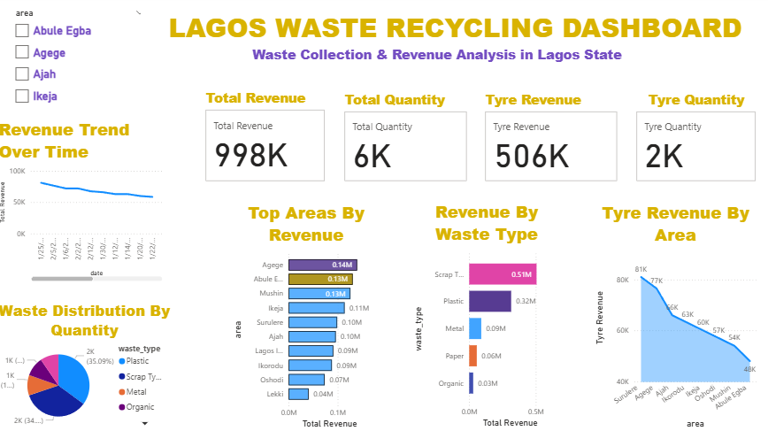

Lagos Waste Recycling Dashboard
📌 Project Overview

This project presents an interactive Power BI dashboard analyzing waste recycling activities across Lagos, Nigeria. The dashboard provides insights into total revenue, waste distribution, tyre recycling performance, and revenue trends across different areas.

The analysis focuses on understanding which waste categories generate the highest revenue and how recycling activities vary across locations.

🎯 Objectives
Analyze total recycling revenue across Lagos
Track total waste quantity collected
Measure scrap tyre recycling performance
Identify top-performing areas by revenue
Visualize waste distribution by category
Monitor revenue trends over time
🛠 Tools Used
Power BI – Dashboard creation & visualization
Excel / CSV – Data preparation
Power Query – Data transformation
📊 Dashboard Features

The dashboard includes:

KPI Cards for:
Total Revenue
Total Quantity
Tyre Revenue
Tyre Quantity
Visualizations:
Revenue Trend Over Time
Revenue by Waste Type
Top Areas by Revenue
Tyre Revenue by Area
Waste Distribution by Quantity
Interactive Area Filter (Slicer)
📈 Key Insights
Scrap tyres generated the highest recycling revenue
Some Lagos areas contributed significantly more revenue than others
Revenue trends showed gradual changes over time
Plastic and scrap tyres accounted for a large share of waste collection
📂 Files Included
lagos_waste_recycling_dashboard.pbix
recycling_data.csv
Dashboard screenshots
📷 Dashboard Preview

(Add your dashboard screenshot here after uploading to GitHub)

Example:

👤 Author

Adewale Lateef
Aspiring Data Analyst | Power BI & Python Projects

GitHub: Adewalleytech1